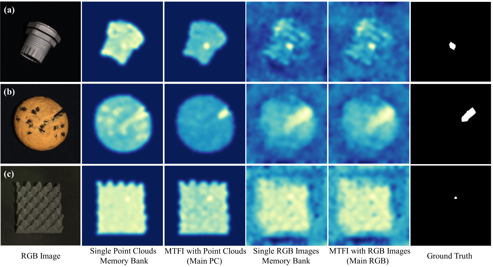

# Cross-Modal Distillation in Industrial Anomaly Detection: Exploring Efficient Multi-Modal IAD

This repository is the official implementation of 
[Cross-Modal Distillation in Industrial Anomaly Detection: Exploring Efficient Multi-Modal IAD](https://arxiv.org/pdf/2405.13571). 

## Visualization of Some Prediction Results

## Requirements
We implement this repo with the following environment:

* Ubuntu 22.04
* CUDA 12.1
* Python 3.11

To install requirements:

```setup
pip install -r requirements.txt
```

>📋  Sometimes conda's version control will cause the installation failure. We recommend using venv or conda to create 
> a virtual environment and then use pip to install all packages.

## Dataset and Pre-trained Models
### Dataset
The `MVTec 3D-AD` dataset can be downloaded from  [MVTec3D-AD](https://www.mvtec.com/company/research/datasets/mvtec-3d-ad). 
It should be unzipped and placed under the `datasets` folder.

### Data Pre-processing
```Pre-processing
python utils/preprocessing.py --dataset_path datasets/mvtec_3d/ 
```
>📋  It is recommended to use the default value for the path to the dataset to prevent problems in subsequent training and evaluation, but you can change the number of threads used according to your configuration. Please note that the pre-processing is performed in place.
### Checkpoints
| Purpose                               | Checkpoint                                                                                          |
|---------------------------------------|-----------------------------------------------------------------------------------------------------|
| Point Clouds (PCs) feature extractor  | [Point-MAE](https://www.dropbox.com/scl/fi/paum3yx6rbpdxbdbytb6m/pointmae_pretrain.7z?rlkey=qc44l0sf8971gm9pcr0tbteyl&st=zlk1i4g3&dl=0)     |
| RGB Images feature extractor          | [DINO](https://www.dropbox.com/scl/fi/u082nmb3t7enxpqkn6jk3/dino_vitbase8_pretrain.7z?rlkey=l3uqnh9xfuuumvuzvdp7akbe7&st=h2l7cuj2&dl=0)          |
| Feature-to-Feature network (main PCs) | [MTFI_FtoF_PCs](https://www.dropbox.com/scl/fi/18ixb16bm0ht4li4pgiuu/MTFI_FtoF_PCs.7z?rlkey=ji9c7p0gjjadnw8crszrl99x9&st=ebgbsadn&dl=0) |
| Feature-to-Input network (main PCs)   | [MTFI_FtoI_PCs](https://www.dropbox.com/scl/fi/g8x64o0t8mi4azxe7hj2w/MTFI_FtoI_PCs.7z?rlkey=srey47rfji710xo10kwqidl41&st=98stctfa&dl=0) |
| Input-to-Feature network (main PCs)   | [MTFI_ItoF_PCs](https://www.dropbox.com/scl/fi/dq9t08s8yrp911b3k9heh/MTFI_ItoF_PCs.7z?rlkey=qsdz1sb2vpxanl2o21udsb238&st=2ec27v42&dl=0) |
| Feature-to-Feature network (main RGB) | [MTFI_FtoF_RGB](https://www.dropbox.com/scl/fi/phh6mpianhr9ffci3b8pe/MTFI_FtoF_RGB.7z?rlkey=w0vs3cyf4ynrw6016px1cpjwm&st=7eik0z5w&dl=0) |
| Feature-to-Input network (main RGB)   | [MTFI_FtoI_RGB](https://www.dropbox.com/scl/fi/9lgeqw8bx5oa2yucfunaz/MTFI_FtoI_RGB.7z?rlkey=iufhvqkz7vv2tik89fmnuq2s9&st=5o06g2lm&dl=0) |
| Input-to-Feature network (main RGB)   | [MTFI_ItoF_RGB](https://www.dropbox.com/scl/fi/jivd2yfe7fk9igj4ikpyf/MTFI_ItoF_RGB.7z?rlkey=3mxf9yor5bfin22vd3j7pjfwd&st=sfva1kym&dl=0) |
>📋  Please put all checkpoints in folder `checkpoints`. 

## Training

To train the models in the paper, run these commands:
### MTFI pipeline with Feature-to-Feature distillation network:
To save the features for distillation network training:
```
python main.py \
--method_name DINO+Point_MAE \
--experiment_note <your_note> \
--save_feature_for_fusion \
--save_path datasets/patch_lib \
```
To train MTFI pipeline with Feature-to-Feature distillation network:
```
python hallucination_network_pretrain.py \
--lr 0.0005 \
--batch_size 32 \
--data_path datasets/patch_lib \
--output_dir <your_output_dir_path> \
--train_method HallucinationCrossModality \
--num_workers 2 \
```
>📋 For MTFI pipeline with Feature-to-Feature distillation network, PCs or RGB images as the main modality are trained simultaneously.
> You can define the maximum number of threads with `--cpu_core_num` and leave your note through `--experiment_note`.
> The results are saved in the `results` folder.
> If you need to output the raw anomaly scores at image or pixel level to a file, add `--save_raw_results` or `--save_seg_results`. You can use `utils/heatmap` to generate similar visualized results.

### MTFI pipeline with Feature-to-Input distillation network:
To save the features for distillation network training:
```
python main.py \
--method_name DINO+Point_MAE \
--experiment_note <your_note> \
--save_frgb_xyz \
--save_path_frgb_xyz datasets/frgb_xyz \
--save_rgb_fxyz \
--save_path_rgb_fxyz datasets/rgb_fxyz \
```
For PCs as main modality.
```
python hallucination_network_pretrain.py \
--lr 0.0005 \
--batch_size 32 \
--data_path datasets/rgb_fxyz \
--output_dir <your_output_dir_path> \
--train_method XYZFeatureToRGBInputConv \
```
For RGB images as main modality.
```
python hallucination_network_pretrain.py \
--lr 0.0005 \
--batch_size 32 \
--data_path datasets/frgb_xyz \
--output_dir <your_output_dir_path> \
--train_method RGBFeatureToXYZInputConv \
```
### MTFI pipeline with Input-to-Feature distillation network:
Similarly, you need to store the features for distillation network training:
```
python main.py \
--method_name DINO+Point_MAE \
--experiment_note <your_note> \
--save_frgb_xyz \
--save_path_frgb_xyz datasets/frgb_xyz \
--save_rgb_fxyz \
--save_path_rgb_fxyz datasets/rgb_fxyz \
```

For PCs as main modality.
```
python -u hallucination_network_pretrain.py \
--lr 0.0003 \
--batch_size 32 \
--data_path datasets/frgb_xyz \
--output_dir <your_output_dir_path> \
--train_method XYZInputToRGBFeatureHRNET \
--c_hrnet 128 \
--pin_mem \
```
For RGB images as main modality.
```
python -u hallucination_network_pretrain.py \
--lr 0.0002 \
--batch_size 32 \
--data_path datasets/rgb_fxyz \
--output_dir <your_output_dir_path> \
--train_method XYZInputToRGBFeatureHRNET \
--c_hrnet 192 \
--pin_mem \
```

## Evaluation

### Evaluate the model on MVTec 3D-AD with single and dual memory bank method
For single PCs memory bank:
```single PCs memory bank
python main.py \
--method_name Point_MAE \
--experiment_note <your_note> \
```

>📋 For single RGB memory bank and dual memory bank, please replace `Point_MAE` with `DINO` and `DINO+Point_MAE`, respectively.

### MTFI pipeline with Feature-to-Feature distillation network:
For PCs as main modality.
```MTFI PCs
python main.py \
--method_name WithHallucination \
--use_hn \
--main_modality xyz \
--fusion_module_path checkpoints/MTFI_FtoF_PCs.pth \
--experiment_note <your_note> \
```

>📋 For RGB images as main modality, please replace `xyz` with `rgb` for `--main_modality` and give the new checkpoint path `checkpoints/MTFI_FtoF_RGB.pth` to the model.

### MTFI pipeline with Feature-to-Input distillation network:
For PCs as main modality.
```
python main.py \
--method_name WithHallucinationFromFeature \
--use_hn_from_rgb_conv \
--main_modality xyz \
--fusion_module_path checkpoints/MTFI_FtoI_PCs.pth \
--experiment_note <your_note> \
```

>📋 For RGB images as main modality, replace `xyz` with `rgb` and give model the new checkpoint path.

### MTFI pipeline with Input-to-Feature distillation network:
For PCs as main modality.
```
python main.py \
--method_name WithHallucination \
--use_hrnet \
--main_modality xyz \
--c_hrnet 128 \
--fusion_module_path checkpoints/MTFI_ItoF_PCs.pth \
--experiment_note <your_note> \
```

For RGB images as main modality.
```
python main.py \
--method_name WithHallucination \
--use_hrnet \
--main_modality rgb \
--c_hrnet 192 \
--fusion_module_path checkpoints/MTFI_ItoF_RGB.pth \
--experiment_note <your_note> \
```

## Citation
If you think this repository is helpful for your project, please use the following.
```
@misc{sui2024crossmodal,
      title={Cross-Modal Distillation in Industrial Anomaly Detection: Exploring Efficient Multi-Modal IAD}, 
      author={Wenbo Sui and Daniel Lichau and Josselin Lefèvre and Harold Phelippeau},
      year={2024},
      eprint={2405.13571},
      archivePrefix={arXiv},
      primaryClass={cs.CV}
}
```
## Acknowledgement
We appreciate the following github repos for their valuable code:
- [M3DM](https://github.com/nomewang/M3DM/)
- [3D-ADS](https://github.com/eliahuhorwitz/3D-ADS)
- [Shape-Guided](https://github.com/jayliu0313/Shape-Guided)
